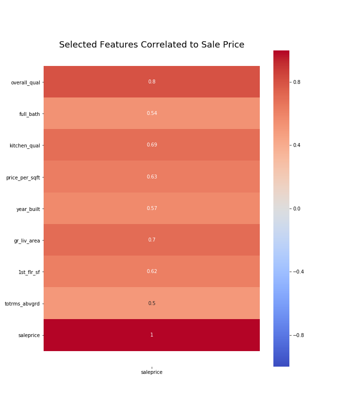
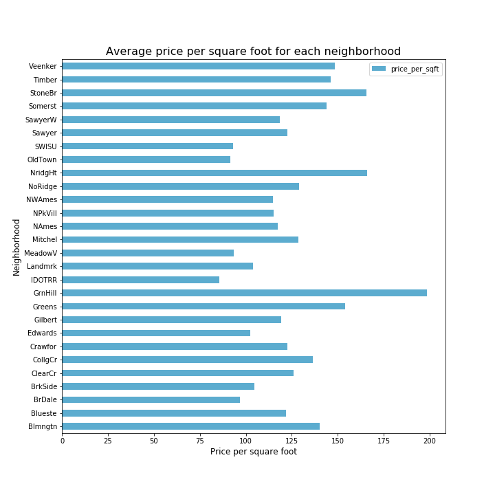
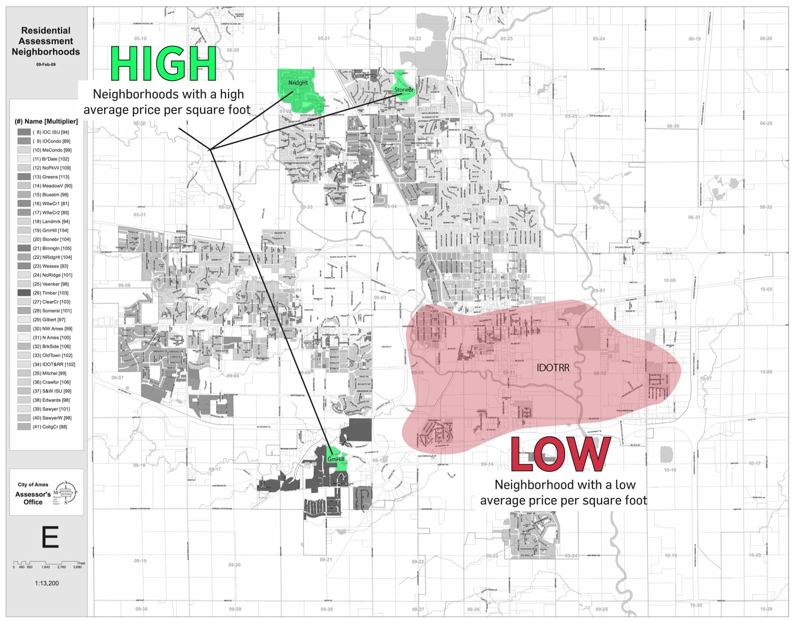
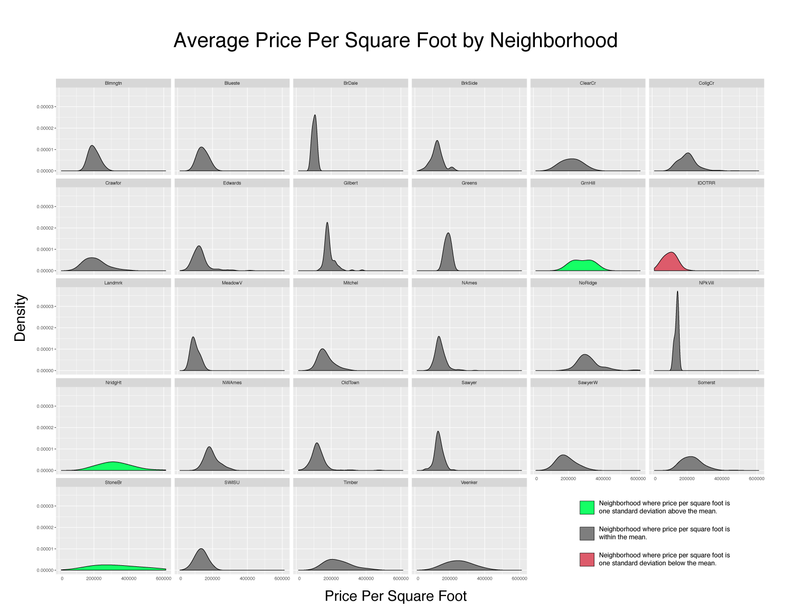
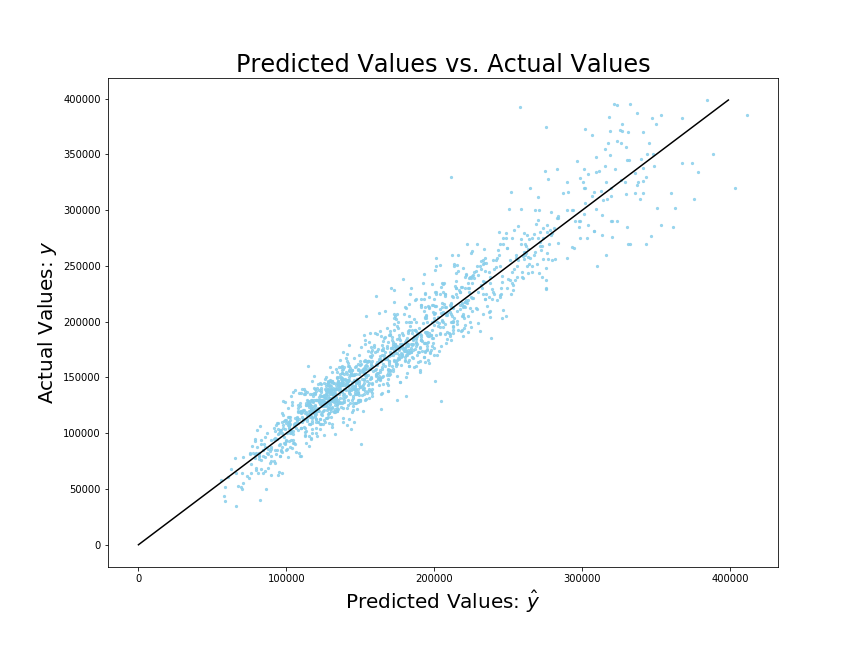

# Project 2: Predicting Housing Prices in Ames, Iowa.

### Executive Summary

In this project, I explored housing data on individual properties sold in Ames, Iowa from 2006 to 2010 to build a model for predicting individual housing prices. I used feature engineering and linear regression models (multiple linear regression, lasso, and ridge) to build my model. 

---

### Problem Statement
Mortgage rates are at an all time low, the [lowest it's been since November 2016.](https://www.cnbc.com/2019/08/05/mortgage-rates-sink-to-3-year-low.html) That means, some individuals may be interested in refinancing their homes for a better mortgage rate. Banks may be interested in reaching these individuals to take a new loan with their bank. However, the process to refinance your home takes a long time. It requires an expert to come to your house and appraise its value before you know what mortgage rate you qualify for. This is an expensive and time-consuming process that people may not want to do. 

How might a bank identify the targeted population who would qualify for lower mortgage rates, and outreach to those individuals?

---

### Data

#### Provided Data
For this project, I used the housing data from the Ames Assessor’s Office used to appraise the value for individual properties in 2006 to 2010. The data was split into training and testing data for the Kaggle competition. The data includes 81 features of each housing sale, including some ordinal (quality ratings), some nominal (classification of neighborhood, zone, sale type), and numeric (square feet, year built). The source for the Kaggle data is [here](https://www.kaggle.com/c/dsi-us-10-project-2-regression-challenge/data). 

- [Training Data](./datasets/train.csv)
- [Kaggle Testing Data](./datasets/test.csv)

#### Submission Data

For the Kaggle competition, I created multiple submissions to see how my models perform. Those can be found [here.](./datasets/submissions)

#### Description of Data

|Predictive Variable|Data type|Description|
|:---|:---|:---|
|overall_qual|Scale of 1 to 10|Rates the overall material and finish of the house|
|full_bath|int|Full bathrooms above grade|
|year_built|int|Original construction date|
|gr_liv_area_log|log of square feet|Log of above grade (ground) living area square feet|
|neighborhood_price_high|0 or 1|Is the neighborhood one standard deviation above the mean price per square feet of the total data set|
|neighborhood_price_low|0 or 1|Is the neighborhood one standard deviation below the mean price per square feet of the total data set|
|has_pool|0 or 1|Does the home have a pool|
|ms_zoning_FV|0 or 1|Is the property in a Floating Village Residential Zone|
|ms_zoning_RL|0 or 1|Is the property in a Residential Low Density Zone|
|ms_zoning_RM|0 or 1|Residential Medium Density|
|exter_cond|Ordinal 1 to 5|Evaluates the present condition of the material on the exterior|
|lot_area_log|log of square feet|Lot size|
|bed_bath_ratio|float|Ratio between number of bedrooms to number of bathrooms|
|garage_qual_cars|float|Interaction between the quality of the garage and the number of cars it fits|
|bsmt_qual|Ordinal 1 to 5|Evaluates the height of the basement|
|has_remodel|0 or 1|Was the property recently remodeled|

### Data Cleaning

The data cleaning work was completed in python for the training data [here](./code/01a_clean.ipynb). Then, I executed the cleaning code as a custom python function [here](./assets/clean.py) to clean the training dataset in the exact same way.

### Exploring the Data

The data exploratory work was completed in python [here](./code/eda.ipynb) and in R [here](./code/visualizations/visualization.R).

To get a baseline understanding of the data, I started with a series of exploratory graphs. To orient around the problem statement specifically, I wanted understand how each feature correlated to sale price. 

Here are the selected features that have an absolute correlation value above 0.5 to sale price.

From this heatmap, we see that features with a strong correlation to sale price include overall quality (ordinal), number of bathrooms, kitchen quality (ordinal), price per square foot, year built, general living area (square feet), first floor area (square feet), and total rooms above grade.

#### How does neighborhood impact sale price?
I wanted to see the impact of neighborhood on sale price, and find where the "Beverly Hills" like neighborhoods exist Ames. To do this, I calculated the average price per square foot for each neighborhood. 

Then I categorized each neighborhood as "high," "medium," or "low." 

|Category|Description|
|:---|:---|
|High|Neighborhoods with an average price per square foot one standard deviation above the population mean|
|Medium|Neighborhoods with an average price per square similar to the population mean|
|Low|Neighborhoods with an average price per square foot one standard deviation below the mean|

There are three neighborhoods that classified as high value: GrnHill, NridgHt, StoneBr, and one neighborhood as low value: IDOTRR. 

[Source of base map](http://jse.amstat.org/v19n3/decock/AmesResidential.pdf)

Next, I created distribution plots for the price per square foot by each neighborhood. I wanted to get a sense of how many properties were sold in each neighborhood. 

The homes in high value neighborhoods did not have a lot of properties sold, compared to homes in the medium and low value neighborhoods.

---

### Feature Engineering

I created some interaction features to capture the relationship between some features.

__Ratio of Bedrooms to Bathrooms__
Divide the total number of full bedrooms by the total number of bathrooms (full bath + half bath). My assumption here is that houses with too many bathrooms over bedrooms may not be as valuable.

__Garage Quality to Number of Cars__
Multiply the overall garage quality (ordinal) to the number of cars that fit in the garage. My assumption here is that garages that fit more cars and have a higher quality would make the house more valuable.

---

### Models

|Model|RMSE|R2 Score Train Data|R2 Score Test Data|
|:---|:---|:---|:---|
|Ridge|19688.42|0.91|0.84|
|Lasso|19702.55|0.91|0.84|
|Multilinear Regression|19814.38|0.89|0.91|

While I had a similar R2 score across my models, around 0.84-0.91, I had the least variance in my multilinear regression model where the R2 scores were closer between my training and data sets. Since Kaggle scores model performance on root mean squared error (RMSE), my ridge regression model performed best, making predictions within \$1968.42. This means that on average, my predictions for housing prices are within \$1968.42 of the actual housing price. 

Here is a graph of the predicted housing prices compared to actual housing prices for my ridge regression model.

My predictions are relatively close to the actual sale price. You can see that the higher the sale price the bigger the difference between my predictions and actual price. 
---

### Next Steps

To make this model useful for banks, I would run this model on updated data. With updated predictions, we can see if a neighborhood has changed from a low or medium value to a high value neighborhood in the past 10 years. Those neighborhoods that have moved up in value would be of interest for banks to reach out to. Having a higher property value affects your mortgage rates, so if your home has increased in value since when you took out a loan, you may qualify for lower rates now.

From there, we could build an online tool to help those in the targeted population group assess what kind of mortgage rates they may qualify for. This model predicted housing prices with just a handful of features. We can build an online tool that asks the homeowner questions about their home that they would know off the top of their head:

1. Zipcode
2. Square foot
3. Year built
4. Garage type
5. Number of bedrooms
6. Number of bathrooms
7. Number of cars that fit in your garage
8. Remodel year
9. Overall quality of your home (on a scale of 1 to 10)

With just a handful of questions, we could provide them an estimate of their home value now and what kind of mortgage rates they could qualify for at a specific bank. This lowers the barrier of entry for a homeowner to become interested in refinancing their home if they know that they have a good shot of having a lower mortgage rate.
